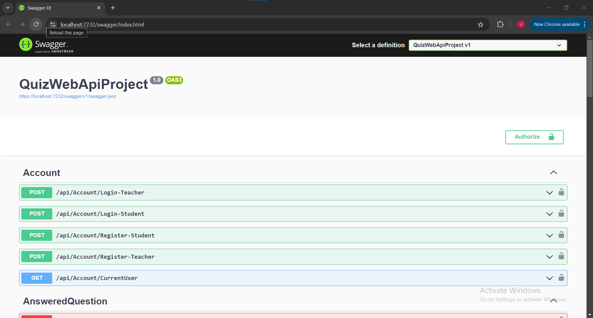
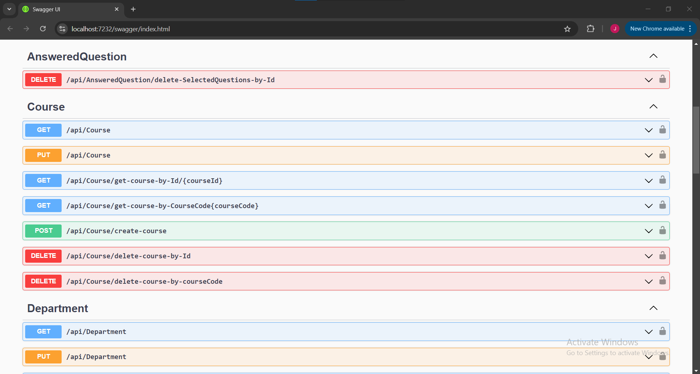
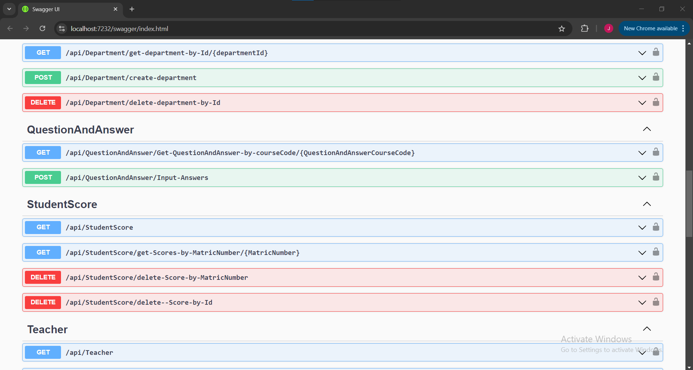

---

# 🎓 Secure Quiz API

A robust, role-based REST API built with **ASP.NET Core** designed to manage online assessments securely. This system facilitates separate workflows for Teachers (administrators) and Students, secured by **JWT (JSON Web Token)** authentication.

## 📖 Overview

This API solves the problem of secure, digital examination management. It enforces strict access controls: only teachers can manage content (courses, departments, questions) and view grades, while students are restricted to taking tests where answers are immutable once submitted to prevent malpractice.

## 📸 Screenshots


 

## ✨ Key Features

### 🔐 Authentication & Security

* **Role-Based Login:**
* **Teachers:** Authenticate using `Staff ID` + `Password`.
* **Students:** Authenticate using `Matriculation Number` + `Password`.


* **JWT Protection:** All endpoints are secured with Bearer tokens to ensure only authorized users access specific resources.
* **Identity Management:** Endpoints available to retrieve the currently logged-in user's profile.

### 👨‍🏫 Teacher Capabilities (Admin)

* **Content Management:** Create, update, and delete Courses and Departments.
* **Question Bank:** Manage multiple-choice questions (Options A-D) linked to specific courses.
* **Score Management:** View student results and delete scores if necessary (by ID or Matriculation Number).

### 👩‍🎓 Student Capabilities

* **Assessment:** Access questions by course or department.
* **Anti-Cheating:** Answers are **final** upon submission; the API rejects attempts to modify submitted answers.

### ⚙️ Background Services & Logging

* **Email Notifications:** Integrated with **SendGrid** for alerts.
* **Task Scheduling:** Uses **Hangfire** for background jobs.
* **Logging:** Comprehensive error and activity logging via **NLog**.

## 🛠️ Tech Stack

* **Framework:** ASP.NET Core
* **Database:** SQL Server
* **Security:** JWT (JSON Web Tokens)
* **Documentation:** Swagger UI
* **Utilities:** SendGrid (Email), Hangfire (Jobs), NLog (Logging)

## 🚀 Getting Started

### Prerequisites

* .NET SDK
* SQL Server
* SendGrid API Key (optional for email features)

### Installation

1. **Clone the repository:**
```bash
git clone https://github.com/Otormin/QuizAPI.git

```


2. **Configure Database:**
Update the `appsettings.json` file with your SQL Server connection string.
```json
"ConnectionStrings": {
  "DefaultConnection": "Server=YOUR_SERVER;Database=QuizDB;Trusted_Connection=True;"
}

```


3. **Apply Migrations:**
```bash
dotnet ef database update

```


4. **Run the API:**
```bash
dotnet run

```


5. **Explore:**
Navigate to `https://localhost:5001/swagger` to view the API documentation and test endpoints.

## 📂 API Endpoints Overview

| Feature | Method | Endpoint | Access |
| --- | --- | --- | --- |
| **Auth** | POST | `/api/auth/login/teacher` | Public |
| **Auth** | POST | `/api/auth/login/student` | Public |
| **Courses** | GET | `/api/courses` | Authenticated |
| **Courses** | POST | `/api/courses` | Teacher Only |
| **Questions** | POST | `/api/questions` | Teacher Only |
| **Answers** | POST | `/api/answers` | Student Only |
| **Scores** | GET | `/api/scores/student/{matricNo}` | Teacher Only |